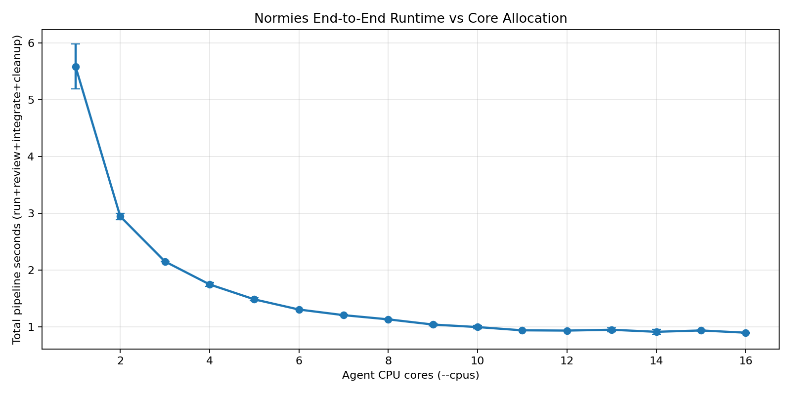
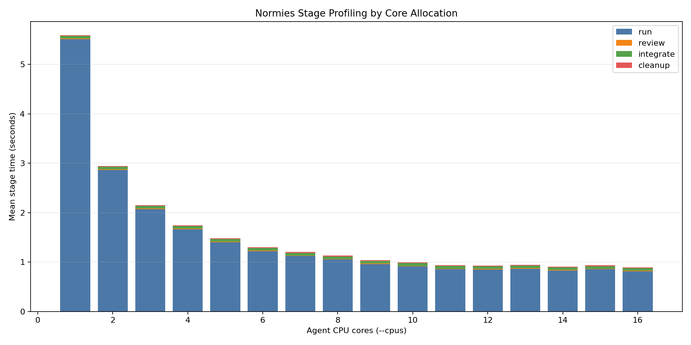
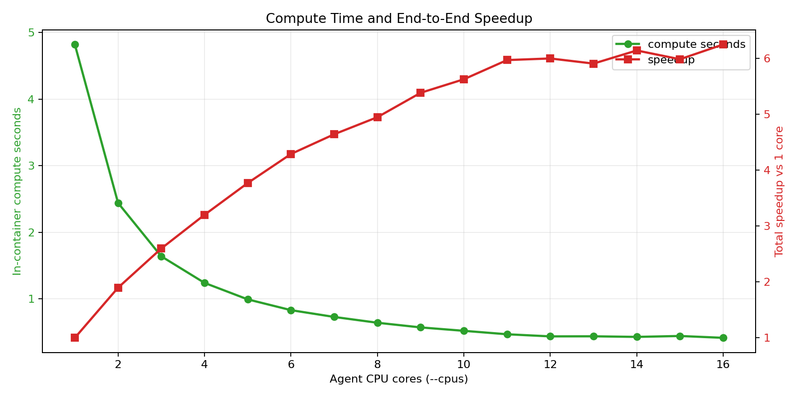

# normies Benchmark Report

Date: 2026-02-18  
Repo: `multi-agents` (`normies` Rust CLI)

## Goal

Measure how `normies` end-to-end runtime changes as agent CPU allocation (`cpus`) increases, and profile stage-level cost across:

- `run`
- `review`
- `integrate`
- `cleanup`

## Environment

- Host: macOS 15 (arm64)
- Logical CPU cores: 16
- Python: 3.14.2
- Cargo: 1.93.1
- Docker: 26.1.4
- uv: 0.9.3

## Experiment Design

- Core sweep: `1..16`
- Trials per core: `2` (total runs: 32)
- Agent image: `python:3.12-slim`
- Agent workload: CPU-bound SHA-256 loop with multiprocessing (`workers == core_count`)
- Total workload per run: `8,000,000` hashes (split across workers)
- Benchmark pipeline measured per trial:
  - `normies run --repo <repo> --spec <spec> --run-id <id>`
  - `normies review --run-id <id>`
  - `normies integrate --run-id <id>`
  - `normies cleanup --run-id <id>`
- Profiling signals collected:
  - Wall-clock time per stage
  - End-to-end total time
  - In-container compute time (`BENCH_COMPUTE_SECONDS`) from agent logs

## Commands Used

```bash
python3 benchmark/scripts/run_benchmark.py --cores all --trials 2 --iterations 8000000
uv run --with matplotlib python benchmark/scripts/plot_profiles.py \
  --input benchmark/results/benchmark_results.csv \
  --plots-dir benchmark/plots \
  --summary benchmark/results/summary.json
```

## Key Results

- Best observed mean total runtime: **0.894s at 16 cores**.
- Baseline (1 core) mean total runtime: **5.588s**.
- End-to-end speedup vs 1 core: **6.25x** at 16 cores.
- `run` dominates total cost at all core counts.
- `review`, `integrate`, and `cleanup` are near-constant overhead (~0.08s combined).
- Scaling shows diminishing returns after roughly 10-12 cores.

## Per-Core Summary

| Cores | Total Mean (s) | Total Std (s) | Speedup vs 1 Core | Run Mean (s) | Review (s) | Integrate (s) | Cleanup (s) | Compute Mean (s) |
| --- | ---: | ---: | ---: | ---: | ---: | ---: | ---: | ---: |
| 1 | 5.588 | 0.397 | 1.00x | 5.511 | 0.011 | 0.051 | 0.015 | 4.821 |
| 2 | 2.946 | 0.057 | 1.90x | 2.866 | 0.011 | 0.053 | 0.015 | 2.440 |
| 3 | 2.151 | 0.002 | 2.60x | 2.071 | 0.012 | 0.052 | 0.016 | 1.638 |
| 4 | 1.746 | 0.033 | 3.20x | 1.665 | 0.011 | 0.054 | 0.016 | 1.239 |
| 5 | 1.482 | 0.025 | 3.77x | 1.403 | 0.011 | 0.053 | 0.016 | 0.991 |
| 6 | 1.303 | 0.001 | 4.29x | 1.222 | 0.011 | 0.053 | 0.017 | 0.829 |
| 7 | 1.204 | 0.009 | 4.64x | 1.123 | 0.011 | 0.053 | 0.017 | 0.727 |
| 8 | 1.129 | 0.008 | 4.95x | 1.050 | 0.011 | 0.052 | 0.016 | 0.639 |
| 9 | 1.038 | 0.022 | 5.38x | 0.960 | 0.011 | 0.052 | 0.015 | 0.569 |
| 10 | 0.993 | 0.031 | 5.63x | 0.915 | 0.010 | 0.052 | 0.017 | 0.518 |
| 11 | 0.936 | 0.010 | 5.97x | 0.856 | 0.010 | 0.053 | 0.016 | 0.466 |
| 12 | 0.932 | 0.006 | 6.00x | 0.851 | 0.011 | 0.053 | 0.017 | 0.434 |
| 13 | 0.946 | 0.037 | 5.91x | 0.866 | 0.011 | 0.053 | 0.015 | 0.436 |
| 14 | 0.910 | 0.046 | 6.14x | 0.829 | 0.011 | 0.053 | 0.017 | 0.427 |
| 15 | 0.934 | 0.015 | 5.98x | 0.854 | 0.011 | 0.052 | 0.017 | 0.440 |
| 16 | 0.894 | 0.007 | 6.25x | 0.813 | 0.011 | 0.053 | 0.017 | 0.413 |

## Profiling Plots

### Total Runtime vs Cores



### Stage-Level Profile by Cores



### Compute Time + Speedup



## Artifacts

- Raw CSV: `benchmark/results/benchmark_results.csv`
- Raw JSON: `benchmark/results/benchmark_results.json`
- Aggregated summary: `benchmark/results/summary.json`
- Scripts:
  - `benchmark/scripts/run_benchmark.py`
  - `benchmark/scripts/plot_profiles.py`

## Interpretation for normies Tuning

- For CPU-heavy agent workloads, increasing `cpus` gives strong gains up to mid/high core counts.
- The fixed orchestration overhead (review/integrate/cleanup) becomes a larger fraction once run-time drops below ~1s.
- For practical use, a **good default operating band is 8-12 cores** for this workload shape; beyond that, gains are smaller and noisier.

## Caveats

- This benchmark uses one synthetic CPU-bound agent and one machine; I/O-heavy or network-heavy agents can scale differently.
- Only two trials per core were used for speed; more trials improve confidence intervals.
- Docker cold-start/pull effects were minimized but not entirely eliminated.
